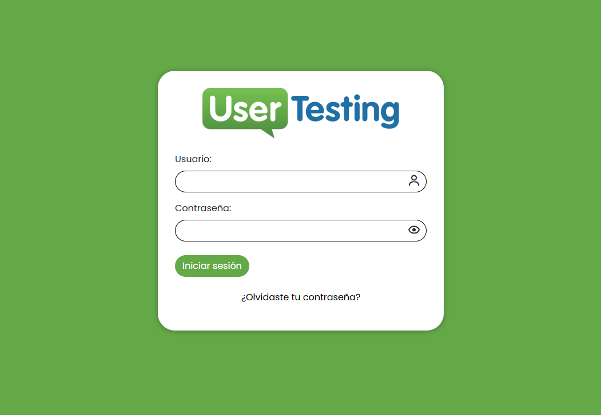
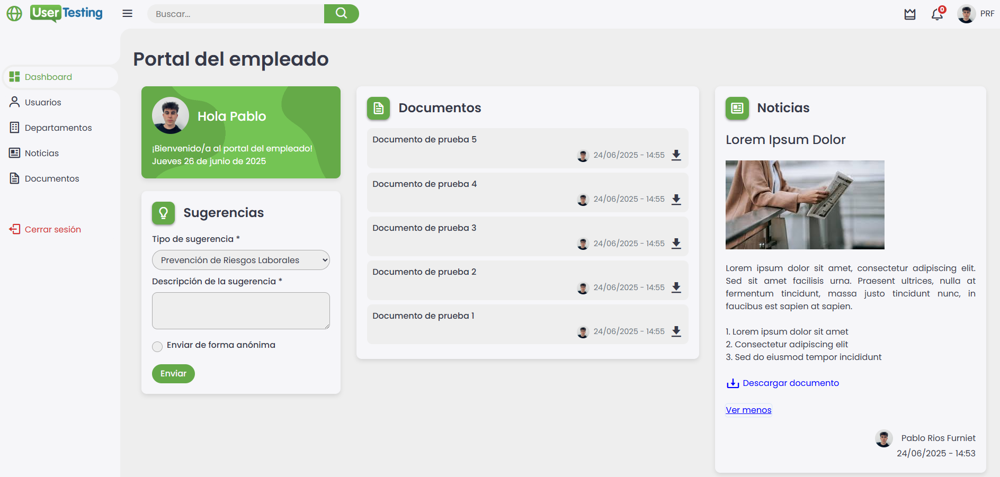
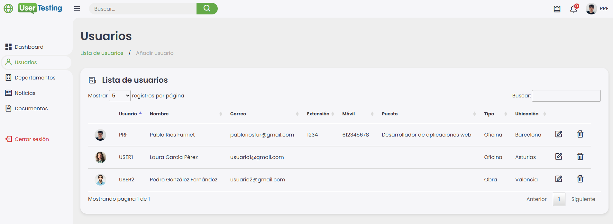
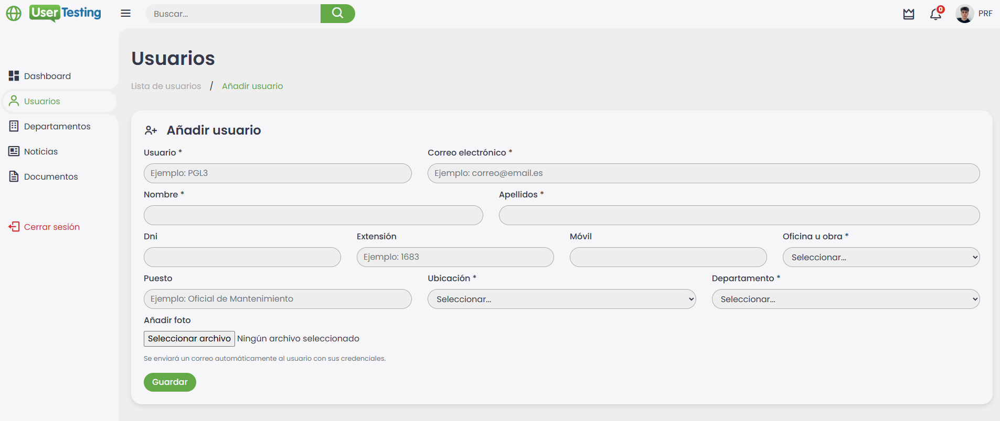
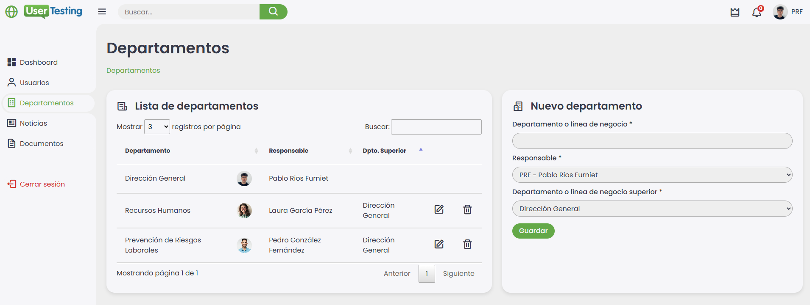
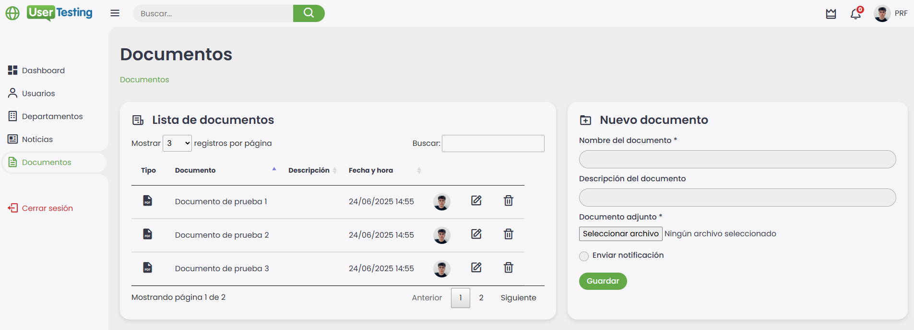
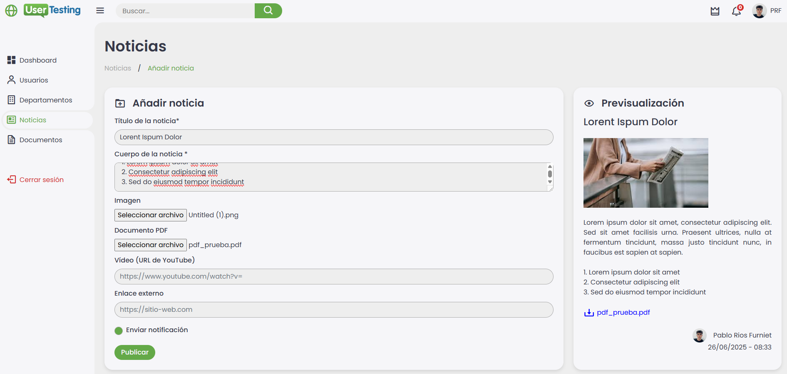
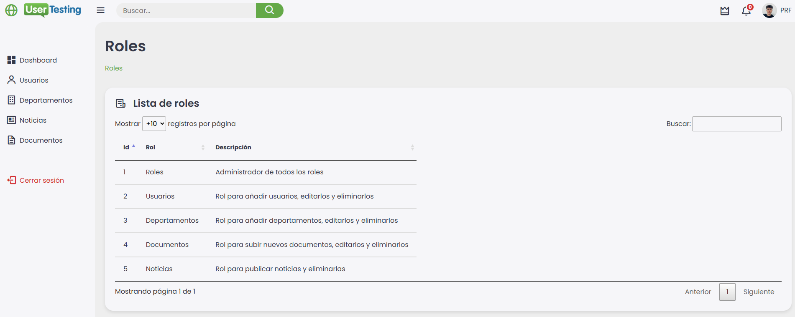

# Admin Dashboard

**Portal web interno para la gestión de usuarios, documentos, departamentos, noticias y roles dentro de una organización.**

## 📸 Capturas de Pantalla

### Inicio de Sesión


### Dashboard Principal


### Gestión de Usuarios



### Departamentos


### Documentos


### Noticias


### Roles


---

## ✉️ Funcionalidades de Correos Automáticos

El sistema está integrado con **PHPMailer** para el envío automático de correos electrónicos en diferentes situaciones del sistema:

- ✅ **Al crear un nuevo usuario**: el sistema envía automáticamente sus credenciales al correo electrónico proporcionado.
- ✅ **Recuperación de contraseña**: los usuarios pueden solicitar un enlace de recuperación que llega a su bandeja de entrada.
- ✅ **Publicación de noticias**: se notifica a los usuarios cuando se publica una nueva noticia.
- ✅ **Carga de documentos**: se pueden enviar notificaciones automáticas a los empleados cuando se añaden documentos relevantes.
- ✅ **Notificaciones personalizadas** configurables desde distintos módulos del sistema.

> Todos los correos utilizan una configuración SMTP segura, y puedes personalizar el remitente y contenido fácilmente desde el código.

---

## ⚙️ Requisitos del Proyecto

- PHP >= 7.4
- MySQL / MariaDB
- Composer
- Servidor Apache (recomendado: XAMPP)
- Navegador moderno

---

## 📁 Instalación

### 1. Clonar el repositorio en `htdocs`

```bash
git clone https://github.com/pablorf10/admin_dashboard.git
```

Asegúrate de que esté en:  
`C:\xampp\htdocs\admin_dashboard`

---

### 2. Configurar el archivo `.env`

Copia el archivo `.env.example` a `.env` y completa tus datos locales:

```env
# En producción hay que poner /
BASE_URL=/admin_dashboard

# En producción hay que poner el dominio del sitio
SITE_URL=localhost/admin_dashboard

DOCS_URL=public/docs

CORREO_NOTIFICACIONES=tu_email@gmail.com

DB_HOST=localhost
DB_DATABASE=admin_dashboard
DB_USERNAME=root
DB_PASSWORD=

MAIL_HOST=smtp.gmail.com
MAIL_PORT=465
MAIL_SMTP_SECURE=ssl
MAIL_USERNAME=tu_email@gmail.com
MAIL_PASSWORD=contraseña_o_token
MAIL_FROM=tu_email@gmail.com
MAIL_FROM_NAME="Admin Dashboard"
```

---

### 3. Importar la base de datos

1. Abre **phpMyAdmin**
2. Crea una nueva base de datos llamada `admin_dashboard`
3. Importa el archivo `admin_dashboard.sql` que está en la raíz del proyecto

---

### 4. Instalar dependencias con Composer

Desde la raíz del proyecto, ejecuta:

```bash
composer install
```

Esto instalará:

```json
{
  "require": {
    "vlucas/phpdotenv": "^5.6",
    "phpmailer/phpmailer": "^6.10",
    "dompdf/dompdf": "^3.1"
  }
}
```

---

## 🔐 Seguridad y Restricciones

Este proyecto está protegido por la siguiente licencia:

```
Copyright © 2025 Pablo Ríos Furniet

Este código está protegido bajo la licencia Creative Commons Attribution-NonCommercial 4.0 International (CC BY-NC 4.0)

Puedes ver, modificar y reutilizar este proyecto con fines personales o educativos, siempre que menciones al autor original.

No está permitido el uso comercial, la redistribución con fines lucrativos ni su inclusión en productos comerciales sin autorización previa.

Más información: https://creativecommons.org/licenses/by-nc/4.0/
```

---

## 📩 Contacto

Desarrollado por **Pablo Ríos Furniet**  
📧 pabloriosfur@gmail.com